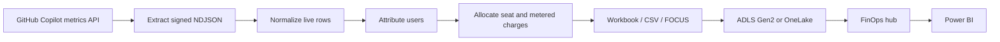

# Copilot AI-credit chargeback

This folder documents the live Copilot usage-metrics chargeback pipeline in
[`tools/copilot-usage`](../../tools/copilot-usage/README.md). It extracts exact AI-credit usage,
attributes users to cost centres, allocates an invoice when one is supplied, and emits an analyst
workbook plus FOCUS-shaped CSV. Model, language, and harness views are interaction telemetry; the
GitHub API does **not** split `ai_credits_used` by model or feature.

## Run it

Offline, with bundled fixtures:

```bash
npm run usage-report -- --from-fixtures
```

Live, with a PAT or GitHub App token in an environment variable (never on the command line):

```bash
export GITHUB_TOKEN="<enterprise-authorized-token>"
node tools/copilot-usage/cli.mjs --live --enterprise <slug> --since YYYY-MM-DD --out <dir>
```

The token needs `manage_billing:copilot` or `read:enterprise` (or the equivalent GitHub App
permission). `GITHUB_TOKEN` cannot call these endpoints. The real scheduled workflow is
[`.github/workflows/copilot-usage-export.yml`](../../.github/workflows/copilot-usage-export.yml).

## Pipeline at a glance



## Pages

- [APIs and verified behaviour](apis.md)
- [Data model and allocation](data-model.md)
- [Automation and operations](automation.md)
- [FOCUS 1.4 and FinOps hub mapping](focus-mapping.md)
- [Outputs and workbook dictionary](outputs.md)

The existing [pipeline recommendation](../copilot-usage-pipeline-recommendation.md) remains the
design rationale for the Actions boundary, Fabric alternative, and operational controls. This
folder is the implementation and output reference; it does not repeat that recommendation.
