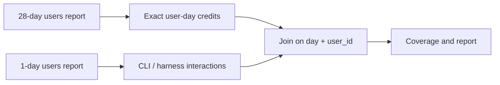
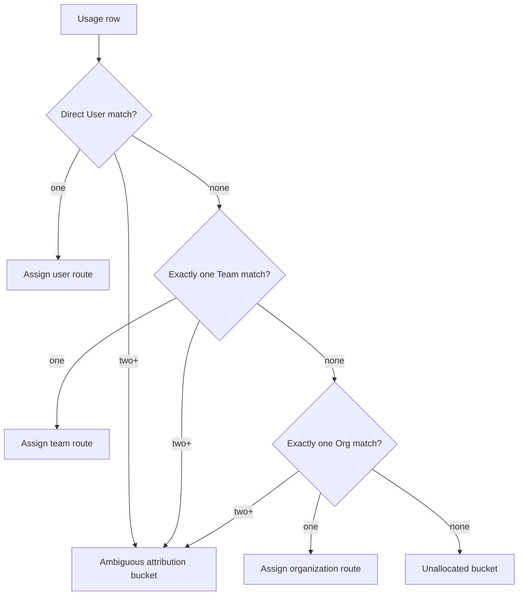

# Data model, attribution, and allocation

## Two-source extraction

The 28-day report is the exact credit spine. Each day is enriched independently because the spine
does not contain CLI or harness fields.



The normalized adapter changes `day` to the internal `day_partition`, coerces IDs to stable strings,
normalizes the adoption phase object, preserves breakdown arrays, and converts missing optional
values to null. The spine remains authoritative even when a daily enrichment day is empty.

## Attribution precedence

Cost-centre resources are normalized from the API's `resources` array. A direct `User` assignment
wins. If none exists, exactly one matching team wins; otherwise exactly one cost-centre-bearing org
wins. The live report has no org ID, so the report joins paginated organization membership by login.
Two or more matches at the winning level are explicit `ambiguous`, never an alphabetical guess.
No match is `unallocated`.



All rows, including ambiguous and unallocated rows, retain their credits. In the verified tenant,
`admin_mbqent01` matched all four organizations and therefore landed in the explicit ambiguous
bucket.

## Seats and charges

Seat records are deduplicated to one row per user. Enterprise wins over Business; equal-tier ties
use earliest start and then source order. This avoids double-counting the observed six records
against five total seats.

One AI credit is exactly $0.01 USD for included and metered credits. GitHub bills through Azure as
two distinct charges: the seat subscription (tier-included credits, pooled at enterprise level) and
the separately priced metered GitHub AI Credits charge. For each `(billing_entity, invoice_period)`
partition, the allocator uses:

```text
user_seat_cost = seat_charge_for_tier
                 * (user_seat_days_in_tier / total_seat_days_in_tier)
user_metered   = metered_charge
                 * (user_ai_credits_used / entity_ai_credits_used)
user_chargeback = user_seat_cost + user_metered
```

Business and Enterprise denominators never mix. A zero-credit entity gives every user zero metered
share. Usage without a current seat still receives metered share and zero seat cost. An idle seat
still carries seat cost. The legacy premium-request multiplier table is not used.

**Conservation is not completeness.** The denominator is made from ingested rows, so shares sum to
the invoice even if users or days are missing; missing cost is silently redistributed. Completeness
is a separate control in `live-manifest.json` and the workbook coverage panel. A report with
enrichment gaps can have exact credits but provisional interaction analysis.

## Rounding

`focus.csv` and `daily-facts.csv` retain full floating-point precision. Workbook USD values in
**By user** and **By cost centre** are rounded to cents for display only; no row-level rounding is
fed back into allocation, so residuals do not accumulate.

Model, language, and surface outputs are interaction-count based. They must not be read as exact
credit or USD splits because GitHub does not publish `ai_credits_used` by model or feature.
